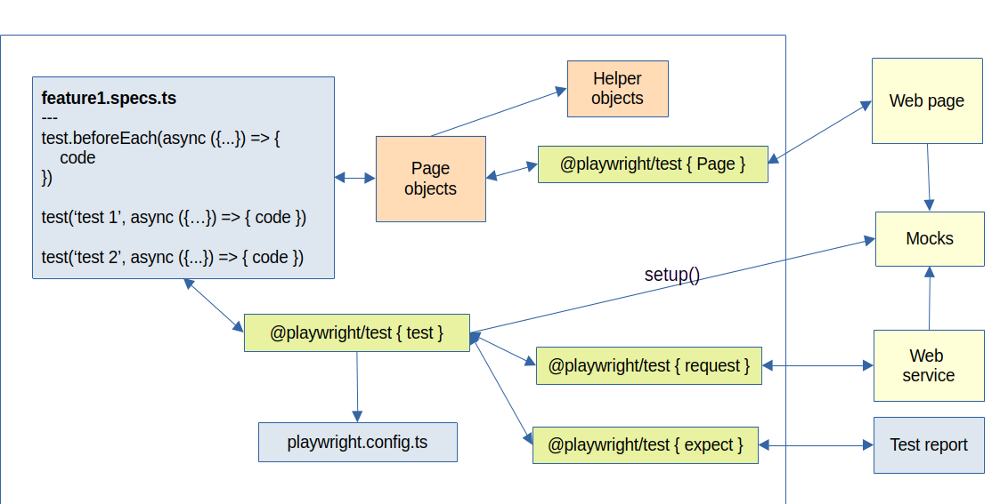

# javascript-playwright
Copyright 2024-2025 Juan M. Fonseca-Solís.

[](https://github.com/juanfonsecasolis-automation/javascript-playwright/actions/workflows/playwright.yml)

Solution for exercises of the course "Playwright: Web Automation Testing From Zero to Hero," by Artem Bondar [1].

[Certificate of completion](http://ude.my/UC-5f317f4a-e620-45ab-ad6c-6a1c54785aa2)

## Setup
1. Install "Playwright Test for VSCode".
1. Install Node.js LTS (if installed, the version can be known by typing `node -v`).
1. Run as sudo `npx playwright install`.
1. Run `npm init playwright@latest`.
1. Run `npm install --save dotnet`.

## Run
```
npx playwright test firstTest.spec.ts --project=Chromium --headed --trace on
npx playwright show-report
npx playwright test --ui
npx playwright test --config=playwright-prod.config.ts
```

One can define custom commands in the package.json file and run them using `npm run <customCommand>`, for instance:
```
"scripts": {
    "pageObjects-chrome": "npx playwright test usePageObjects.spec.ts --project=Chromium"
}
```

## System diagram


## Using the Faker library
```
npm i @faker-js/faker --save-dev --force
```

## Debugging
```
npx playwright test firstTest.spec.ts --project=Chromium --headed --trace on --debug
```

Another way to debug is to generate "traces", a bundle of information for debugging containing
images ordered in sequential order and network information. To enable traces, we modify the property `use.trace` in file playwright.config.ts by setting `trace: 'on-first-retry'` to 
`trace: 'on'`. The traces are attached to the bottom of each failed test case on the Playwright report.

## Retries

By default, the retry option is disabled. Playwright retries failed test cases alone, in a new browser session. When the retry is activated, Playwright retries the failed test cases and the passed test cases in a new browser session. The retry flag can be configured in the playwright.config.ts file by changing `retries: process.env.CI ? 2 : 0` to `retries: process.env.CI ? 2 : 1` or `retries: 1,`. 

Alternatively, retry can be configured just for one test suite:
```
test.describe('Form Layouts page', () => {
    test.describe.configure({retries: 2})
    
    test('test1', async({page}), testInfo => {
        if(testInfo.retry)
        {
            // clean database (anything that you want to use on each retry)
        }
    })

})
```

## Paralelism
By default, Playwright runs in parallel by creating a new worker (web browser instance) per spec file. At the playwright.config.ts file, `fullyParallel: true` determines if tests can be run in parallel inside each spec file (otherwise they run sequentially), and `workers: process.env.CI ? 1 : undefined` determines the number of spec files that run in parallel (apparently, no more than five, why?). One can order the number of executions of spec files by adding a prefix (for instance, 001-*). One can also control whether a single spec file can run its tests in parallel:

```
import { test, expect } from '@playwright/test'

test.describe.configure({mode: 'parallel'})
```

It is not a good practice to make tests execute in a certain order, but that can be achieved by adding `test.describe.configure({mode: 'serial'})` to the test suite.

## Video recording
Enabled on "use" tag at playwright.config.ts (by default 100 by 100 pixels) and run the tests via CLI:
```
video: 
{
    mode: 'on',
    size: {width:1920, height:1080}
}
```
The video will be saved in the test results folder and attached automatically to the report.

## Skip test cases
```
test.skip('test1', async(test{page}), testInfo => {
    ...
```

## Fixtures
They are like the Before/After test hooks, but more powerful to set up our test environment in advance.

## Tags
Use as follows: `npx playwright test --project=chromium --grep smoke`. Tags are defined at the test case or test suite level, as below:
```
test('navigate to form page @smoke @regression', async ({page}) => {
    const pm = new PageManager(page)
    await pm.navigateTo().formLayoutsPage();
    ...

test.describe('Form Layouts page @smoke', () => {
    ...
```

Multiple tags can be used by specifying the pipe symbol, as follows: `npx playwright test --project=chromium --grep @smoke|@regression` (Linux) or `npx playwright test --project=chromium --grep --% @smoke^|@regression^` (Windows).

## Allure
Installation on Linux:
```
sudo apt-get install default-jre-headless
sudo apt-get install allure
npm i -D @playwright/test allure-playwright --force
wget https://github.com/allure-framework/allure2/releases/download/2.33.0/allure_2.33.0-1_all.deb
sudo dpkg -i allure_2.33.0-1_all.deb 
```

To generate the HTML report (run the test project first):
```
allure generate allure-results -o allure-results --clean
```

## Generate screenshots
For image-to-image assertions (like Sikuli in Selenium):
```
npx playwright test --update-snapshots
```
Ground-of-truth images are created inside the test folder, under a folder with the name of the file where the "toHaveScreenshot" method is invoked. Example:
```
npx playwright test --project=chromium --grep snapshot
```

Differences in snapshots can be later seen in the test report: 


# Application under test (Angular)
```
cd pw-practice-app # otherwise, clone it from git@github.com:bondar-artem/pw-practice-app.git
npm install --force
npm start
open http://localhost:4200/
```

## Docker
Building a Docker image and running the tests in a container: 
1. Install Docker Engine using the steps described on [3].
1. Install Docker Desktop using the steps described on [4].
1. Start Docker Desktop `docker desktop start` to monitor the containers.
1. Build your personal "pw-pageobject-test" image `docker build -t pw-pageobject-test .` (remember to comment globalSetup and globalTeardown until we find a way to send email/password securely).
1. Run the image in a container in interactive mode: `docker run -it pw-pageobject-test`.
1. Run the test project typing `npm run pageObjects-chrome` or `npx playwright test --project=pageObjectFullScreen`.

To access the test report, we need to copy it to the host machine running something called Docker Compose (a way to orchestrate/control container creation, command execution, and return values):
```
sudo apt-get install docker-compose
docker-compose up --build
```
## Argos CI
Install the Argos CI library:
```
npm i --save-dev @argos-ci/playwright --force
```
Integrate with GitHub Actions (GitHub settings > Argos CI).

## JavaScript review lessons
```
cd lessons
node lesson1.js
...
```

## Troubleshootle
When using `import user from '<jsonPath>' assert { type: "json" }` error 'ReferenceError: require is not defined in ES module scope' might appear, to bypass it set in the package.json `type: 'commonjs'` [2].

## Theory

### Page Object Model (POM)
"It is a design pattern used in test automation to organize source code, improve maintainability, and reusability of the code. Every page of the application has its class with methods responsible for operations on this page." - A. Bondar

POM is based on the _Don't repeat yourself_ (DRY) and _Keep it simple stupid_ (KISS) principles; and it is a good companion for _descriptive naming_, which is naming members in a meaninful way, and _avoid tiny methods_, which is creating methods for code blocks instead of single statements, which overcomplicates the development.

## Is Javascript a suitable language for automation?
See [this article](Discussion.md).

## References
1. Artem Bondar. Playwright: Web Automation Testing From Zero to Hero. Udemy. URL: https://www.udemy.com/course/playwright-from-zero-to-hero (last consulted on 12/6/24).
2. Alinton Gutierrez in reply to AskCoder. ReferenceError: require is not defined in ES module scope, you can use import instead gulp sass. StackOverflow. URL: https://stackoverflow.com/questions/69099763/referenceerror-require-is-not-defined-in-es-module-scope-you-can-use-import-in (last consulted on 07/04/25).
3. Docker. Install Docker Engine on Ubuntu. URL: https://docs.docker.com/engine/install/ubuntu/#install-using-the-repository (last consulted on 14/04/25).
4. Docker. Install Docker Desktop on Ubuntu. URL: https://docs.docker.com/desktop/setup/install/linux/ubuntu/ (last consulted on 14/04/25).
